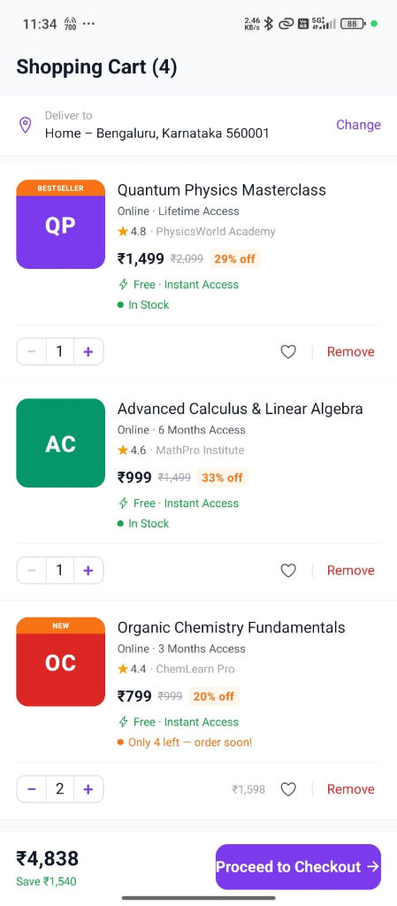
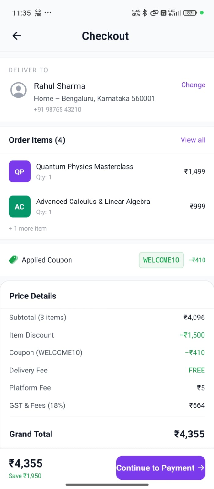
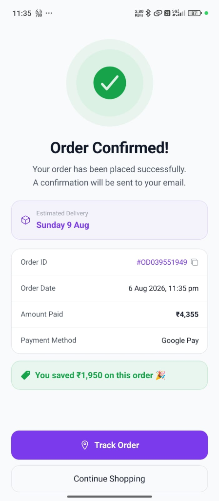

# 🛒 Smart Cart & Checkout Experience

> A production-inspired React Native ecommerce checkout module with intelligent coupon discovery, real-time validation, dynamic pricing, and seamless payment flow.

**Originally developed as part of the Coupon Engine assignment.**

[](https://reactnative.dev/)
[](https://expo.dev/)
[](https://www.typescriptlang.org/)
[](https://opensource.org/licenses/MIT)

---

## 🚀 Live Demo

| Type | Link | Description |
|---|---|---|
| 🎥 **Demo Video** | [Watch Video Demonstration](https://drive.google.com/file/d/13ln7w--rHjNZQF8Hr931kPCXjhgqa4X5/view?usp=drivesdk) | Google Drive Video Demo |
| 📦 **APK Download** | [Download Android APK](https://expo.dev/accounts/bprince203/projects/coupon-engine/builds/32e93e7a-b9c0-44f0-863a-ccf5ec7dd444) | Direct APK Download from Expo EAS |
| 💻 **GitHub Repository** | [Coupon-Engine](https://github.com/bprince203/Coupon-Engine) | Source Code Repository |

---

## 📌 Project Overview

A production-inspired React Native Cart & Checkout experience that demonstrates coupon discovery, eligibility validation, real-time pricing, modern ecommerce UX, payment flow and order confirmation.

---

## 🔄 User Flow

```
Shopping Cart
    ↓
Coupon Selection (Bottom Sheet)
    ↓
Checkout Summary
    ↓
Payment Processing
    ↓
Order Success
```

---

## ✨ Key Features

- **Shopping Cart**: Item listing with high-res thumbnails, variant/seller details, stock indicators (`In Stock` / `Only X left`), and instant delivery badges (`⚡ Free · Instant Access`).
- **Quantity Management**: Smooth, responsive quantity controls with instant subtotal and tax calculation updates.
- **Remove Products**: Fast item removal with undo / toast feedback and smooth list animations.
- **Empty Cart Recovery**: Illustrated zero-state with a one-tap **Continue Shopping** action that automatically restores original demo items.
- **Continue Shopping**: Seamless recovery flow so the user is never left stranded in a dead-end state.
- **Coupon Bottom Sheet**: Contextual modal bottom-sheet interface for discovering and applying coupons directly within the cart without screen switches.
- **Intelligent Coupon Discovery**: Auto-surfaces the **Best Coupon** recommendation banner with exact savings calculation.
- **Coupon Eligibility**: Clear breakdown of valid, locked, and expired coupons.
- **Locked Coupon Progress**: Visual progress bar (`₹X of ₹Y`) displaying exact remaining spend required to unlock higher-tier discounts.
- **Automatic Coupon Validation**: Pipeline-driven validation engine executing rules in real-time.
- **Dynamic Price Calculation**: Real-time breakdown of subtotal, product discount, coupon savings, delivery fee, platform fee, and GST.
- **Order Summary**: Comprehensive checkout screen showing delivery address, order items preview, active coupon, and final price breakdown.
- **Payment Screen**: Interactive payment method selection (Google Pay, PhonePe, Paytm, BHIM, Cards, Net Banking, Wallets) with real-time processing simulation.
- **Order Confirmation**: Celebratory completion screen with order ID, itemized totals, track order action, and savings callouts.
- **Responsive UI**: Pixel-perfect layout with 16px border radii, 8pt spatial grid, generous whitespace, and adaptive safe area handling.
- **Smooth Micro Interactions**: Scale-on-press feedback, spring layout transitions, and entrance animations via React Native Reanimated.

---

## 📸 Screenshots

| Shopping Cart | Price Details | Coupons |
|:---:|:---:|:---:|
|  |  |  |
| *Shopping Cart* | *Price Details Breakdown* | *Coupon Bottom Sheet* |

| Checkout | Payment | Order Confirmation |
|:---:|:---:|:---:|
|  |  |  |
| *Checkout Review* | *Payment Method Selection* | *Order Confirmation* |

---

## 🛠 Tech Stack

- **React Native**
- **Expo**
- **TypeScript**
- **React Navigation**
- **Zustand**
- **React Hook Form**
- **Zod**
- **Expo Clipboard**

---

## 🧠 Architecture

```
┌─────────────────────────────────────────────────────┐
│                    App.tsx                          │
│       GestureHandler → SafeArea → QueryClient       │
│              → Theme → Navigation                   │
├─────────────────────────────────────────────────────┤
│                  Navigation Layer                   │
│         CartStackNavigator (Cart → Checkout →       │
│               Payment → OrderSuccess)               │
├─────────────────────────────────────────────────────┤
│                   Screen Layer                      │
│   (CartScreen, CheckoutScreen, PaymentScreen,       │
│              OrderSuccessScreen)                    │
├──────────────┬──────────────┬───────────────────────┤
│  Components  │    Hooks     │    Zustand Stores     │
│ (Pure UI &   │ (Data flow & │ (Cart state, active   │
│ Cards/Sheet) │ Toast/Theme) │     coupon state)     │
├──────────────┴──────────────┴───────────────────────┤
│                  Service Layer                      │
│   ValidationEngine → Chain of Responsibility Rules  │
│          (Code, Expiry, MinOrder, Category)         │
└─────────────────────────────────────────────────────┘
```

- **Feature-Based Architecture**: Modular feature isolation in `src/features/cart/` and `src/features/coupons/`.
- **Reusable Components**: Modular UI controls (`QuantityStepper`, `PriceBreakdown`, `CheckoutFooter`, `PaymentMethodCard`, `AnimatedPressable`).
- **Separation of UI and Business Logic**: Zero validation math inside React components; all coupon calculations execute via pure services.
- **Coupon Validation Service**: Chain of Responsibility pattern for fail-fast coupon validation.
- **State Management**: Zustand handles single source-of-truth for cart items and applied active coupon.

---

## 💡 Why This Design?

Instead of creating standalone coupon pages or separate navigation tabs, coupon discovery and validation were integrated directly into the cart checkout experience via a modal bottom sheet. This design pattern mirrors industry-leading ecommerce applications like **Amazon**, **Flipkart**, **Zepto**, and **Blinkit**, reducing cognitive friction, eliminating unnecessary navigation steps, and maintaining user focus on completing their order.

*Note: While inspired by modern ecommerce interaction patterns, the implementation, code structure, and design tokens are completely original.*

---

## 📁 Folder Structure

```
src/
├── features/
│   ├── cart/                  # Cart & Checkout Feature Module
│   │   ├── api/               # Product mock data & API layer
│   │   ├── components/        # CartItemCard, CouponDrawer, CouponDrawerCard,
│   │   │                      # PriceBreakdown, CheckoutFooter, PaymentMethodCard,
│   │   │                      # QuantityStepper
│   │   ├── screens/           # CartScreen, CheckoutScreen, PaymentScreen,
│   │   │                      # OrderSuccessScreen
│   │   ├── store/             # useCartStore (Cart state & actions)
│   │   └── types/             # Cart domain models & OrderSummary
│   └── coupons/               # Coupon Engine Domain
│       ├── api/               # Mock coupon dataset (mockData.ts)
│       ├── hooks/             # Data fetching hooks (useCoupons)
│       ├── services/          # ValidationEngine & DiscountCalculator
│       │   └── validators/    # Code, Expiry, MinOrder, Category validators
│       ├── store/             # useCouponStore (Active coupon state)
│       ├── types/             # Coupon & Validation interfaces
│       └── utils/             # formatCurrency, formatDate
├── shared/                    # Generic reusable components & hooks
├── navigation/                # CartStackNavigator & RootNavigator
└── theme/                     # Design tokens (Colors, Typography, Spacing, ThemeContext)
```

---

## 🚀 Setup & Running Locally

### Prerequisites
- Node.js 18+ (22.x recommended)
- npm 9+
- Expo CLI (`npx expo`)
- iOS Simulator / Android Emulator or Expo Go app on a physical device

### Installation
```bash
# Clone the repository
git clone https://github.com/bprince203/Coupon-Engine.git
cd CouponEngine

# Install dependencies
npm install

# Start the Expo development server
npx expo start
```

### Keyboard Shortcuts in Expo Terminal
- `i` — Open in iOS Simulator
- `a` — Open in Android Emulator
- `w` — Open in Web Browser

---

## 🔮 Future Improvements

- Authentication
- Backend Integration
- Wishlist
- Saved Addresses
- Order History
- Push Notifications
- Personalized Coupon Recommendations
